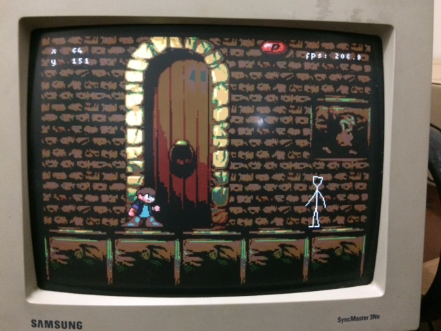
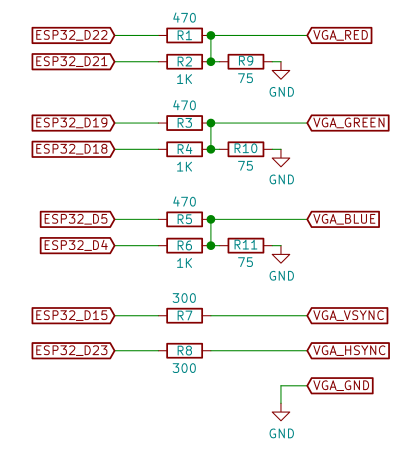
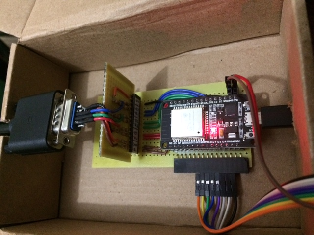

# esp32-loser

This is an old game, [Loser
Corps](https://github.com/moefh/loser-corps), ported to the
[ESP32](https://www.espressif.com/en/products/socs/esp32)
microcontroller using bitluni's
[ESP32Lib](https://github.com/bitluni/ESP32Lib) to output the game
screen to a VGA monitor.  It supports a few controllers: the Wiimote
via Bluetooth using takeru's
[Wiimote](https://github.com/takeru/Wiimote) library, wired Wii
nunchuk and classic classic via I2C and also generic Arduino joystick
shields. There's currently no sound output.

Click the image to see the video on Youtube:

The directory `vga_game` contains an Arduino IDE sketch than can be
uploaded to an ESP32 module.

## VGA Output

The VGA output has 2 bits per color channel (which results in an image
of 64 colors). I use some very simple homemade DACs built with a few
resistors on a perfboard, but there are people around selling nice
PCBs -- just google "ESP32 VGA board".

Here is the schematic for my VGA output:

I'm pretty sure my attempt at matching the impedance of VGA monitors
(75 ohms) is not really right, but this setup does produce correct
voltage levels (it outputs 0.63V for full color intensity, where VGA
specifies 0.7V). In any case, the image looks nice enough in the
monitor.

Here's a photo of the ESP32 with my homemade VGA board with the DACs:

The jumpers coming down out of it are connected to a common Arduino
joystick shield.

## Supported Controllers

The controller must be selected at compile time in the file
`vga_game.ino`.  Currently the game supports these controllers:

Controller             | Connection/Bus            | Support Code
-----------------------|---------------------------|----------------
Wiimote                | Bluetooth                 | takeru's [Wiimote](https://github.com/takeru/Wiimote) library
Wii Nunchuk            | I2C                       | `wii_i2c.c`
Wii Classic Controller | I2C                       | `wii_i2c.c`
Arduino Joystick       | One wire per button/axis  | simple `digitalRead()` and `analogRead()`

To use the Wii nunchuk or classic controller I recommend using an
[adapter like this](https://www.sparkfun.com/products/retired/9281)
(sadly not for sale anymore) so you can avoid destroying your
controller's plug.

The I2C code uses the [ESP-IDF
I2C API](https://docs.espressif.com/projects/esp-idf/en/latest/esp32/api-reference/peripherals/i2c.html)
because the [Arduino Wire
API](https://www.arduino.cc/en/reference/wire) doesn't work
consistently with the Wii controllers on the ESP32 (I *think* it's
because it doesn't play well with FreeRTOS). The code for that is in
the files `wii_i2c.c` and `wii_i2c.h`.

## Graphics Code

The code originally used bitluni's
[ESP32Lib](https://github.com/bitluni/ESP32Lib) for VGA output, but
now the VGA signal generation code was extracted from there to
`vga_6bit.cpp` in an attempt to reduce memory usage (we don't need any
of the fancy drawing functions or 14-bit VGA output code from
ESP32Lib).

Other than that, the only thing of note about the code is the way the
images are prepared and copied to the framebuffer.  In order to make
things fast, the image data is pre-baked with the vsync and hsync
signal bits added to each pixel, which means that they'd have to be
generated again if a VGA mode with different vsync/hsync polarity is
used.

The image data is copied 4 bytes at a time to the framebuffer, because
copying one byte at a time is simply too slow. This is way more
annoying than one would expect, because (due to the way the I2S bus
works in the ESP32) the order of the bytes don't match the order of
the pixels in the screen, so lots of shifting and re-arranging data is
required. There are 4 different versions of the drawing code, one for
each way the source image is aligned to the screen in a 4-byte
boundary.  Each of these versions has to be done twice -- once for
drawing all image pixels (for the background) and another for drawing
images with transparent pixels (for sprites and objects in the
foreground), which is much slower but still way faster than copying one
byte at a time.

## Network support

There's preliminary network support (disabled by default) using
[ESP-NOW](https://docs.espressif.com/projects/esp-idf/en/latest/esp32/api-reference/network/esp_now.html).

Currently, (if enabled) the network code will broadcast as fast as
possible the main character's position and frame, and if any packet
from another ESP32 is received, its character will be shown at the
received position.  That's enough for two players to see each other on
their respective screens, but nothing else.

The code is disabled because there's not enough memory in the ESP32 to
enable WiFi and the two 320x240 framebuffers used for the VGA output.
When testing the network code, I had to decrease the resolution to
240x240 in order for everything to fit (that option is still available
by passing `low_res_mode=true` to `GameScreen::init()`).  It might be
possible to keep the original resolution if enough memory can be saved
by tweaking the ESP32 libraries by using ESP-IDF instead of the
Arduino libraries, but I haven't tried that yet.

## Image Conversion Tools

The directory `conv_img` contains tools for converting images for
inclusion on the game source code (as header files), with the vertical
and horizontal sync bits added and bytes scrambled in the correct
order.

Currently the following tools are included:

- `conv_spr`: a command line tool for converting `.spr` files from
  the [original game](https://github.com/moefh/loser-corps)

- `conv_bmp`: a command line tool for converting generic `.bmp` files

Note that the game draws pure green (`#00ff00`) as transparent in
sprites and foreground tiles (in background tiles it will still appear
as green).
